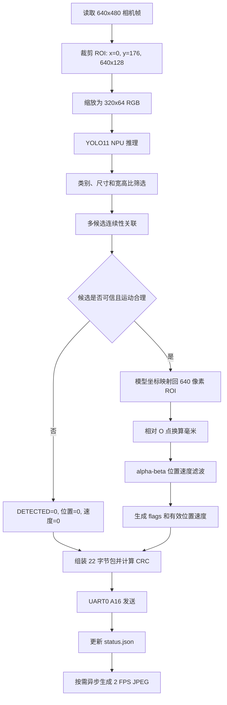

# MaixCAM 钢球位置串口接入说明

本文供电控端直接接入当前 MaixCAM Pro YOLO11 钢球识别程序。协议实现以
[`app/ball_uart_protocol.py`](app/ball_uart_protocol.py) 为准，板端配置以
[`config/ai_ball.json`](config/ai_ball.json) 为准。

## 1. 当前可用状态

- 板端程序：`ai_yolo_today_v3`
- MaixPy 接口：`nn.YOLO11()` + `model.detect()`
- 串口：MaixCAM `UART0`，`115200 8N1`，无流控
- 发送频率：验收下限为 `30 Hz`；上一版 `320x96` 模型约为 `45.9 Hz`，本版
  `320x64` 仍需转换后在板端实测
- 包长：固定 `22` 字节，无换行符
- 网页状态：`http://10.5.66.1:8080/status.json`
- 当前坐标：画面中心 `x=320` 为零点，画面向右为正，向左为负
- 当前换算：`0.390625 mm/px`，机械安装完成后仍需重新标定

本版最终 ONNX 在今天定型结构的 598 张原图上复测结果：

- 455 张有球图在阈值 `0.25 / 0.50 / 0.70` 下均为 0 漏检
- 143 张无球图在相同阈值下均为 0 误报
- 94 张人工复核动态帧的横坐标误差中位数 `0.34 px`
- 横坐标误差 p95 `1.67 px`，最大 `3.58 px`

以上是 PC 端模型和 ONNX 一致性结果，不等同于板端 UART 链路验收。转换部署后仍须
统计板端检测频率、UART 频率、CRC、序号丢包和接收超时。短暂掉检时，发送包会清除
`DETECTED` 并把位置和速度字段置零，因此控制端必须先判断标志位，再使用位置。

## 2. 每一帧从图像到串口的流程

每个成功读取的相机帧都会完成一次检测，并尝试发送一个 22 字节状态包。网页图传
只从检测结果中抽取约 2 FPS，不决定识别和串口频率。主循环见
[`app/maixcam_ai_ball.py`](app/maixcam_ai_ball.py)，候选关联和跳变拒绝见
[`app/ai_ball_detector.py`](app/ai_ball_detector.py)。



### 2.1 读取和预处理

1. 相机请求 `640x480 @ 60 FPS`，缓冲区数量为 3，当前不做镜像和翻转。
2. 从完整画面裁剪 `(x=0, y=176, width=640, height=128)` 的水管 ROI。
3. 将 ROI 缩放为模型固定输入 `320x64 RGB`。因此模型横坐标乘以 2 即可映射回
   当前 640 像素 ROI。
4. 当前使用 NPU 双缓冲 `dual_buff=True`。实测单次推理约 `1.2 ms`；首次开启
   UART 和 2 FPS 图传时约 `45.9 Hz`，轻载状态瞬时可达到约 `56.9 Hz`。

### 2.2 YOLO11 产生候选框

调用参数为：

```text
confidence_threshold = 0.25
iou_threshold        = 0.45
class_id              = 0
```

每个 YOLO 输出还要通过以下几何筛选，单位均为 `320x64` 模型像素：

- 框宽和框高都必须在 `4..48 px`
- 宽高比必须在 `0.45..2.2`
- 框中心必须位于模型画面内

不符合条件的框不会进入位置计算。一个画面存在多个框时，不会直接选择置信度最高
的框，而是进入连续性关联。

### 2.3 连续性关联和跳变拒绝

未锁定目标时，需要连续 2 帧在相近位置发现同一个候选，才输出有效钢球位置。
多个置信度接近但位置相距很远的候选会被判为 `ambiguous`，本帧无效。

已经锁定目标时，程序根据上一位置和估计速度预测本帧位置，只接受同时满足以下
条件的候选：

- 最大运动速度：`1280 model-px/s`，约等于 `1000 mm/s`
- 额外单帧跳变余量：`8 model-px`，约等于 `6.25 mm`
- 相对预测位置的门限：`64 model-px`，约等于 `50 mm`
- 目标锁定保留时间：`0.25 s`

没有候选时原因是 `no_candidate`；候选运动不合理时是 `jump_rejected`；多目标
冲突时是 `ambiguous`。这三种情况都不会更新位置滤波器，也不会把猜测坐标标为
有效数据。

### 2.4 坐标换算和滤波

候选框中心从模型坐标映射到相机坐标：

```text
ball_x_px = roi_x + model_center_x * roi_width / model_width
          = model_center_x * 2

offset_px   = ball_x_px - 320
position_mm = offset_px * 0.390625
```

当前 `position_sign=+1`，因此画面向右为正。机械安装、镜像或相机方向变化后必须
重新确认符号和 `mm_per_pixel`。

有效测量进入 alpha-beta 滤波器：

```text
alpha = 0.7
beta  = 0.2
```

连续 3 个有效测量后才置位 `VELOCITY_VALID`。超过 `0.2 s` 没有有效测量，下一次
重新检测到钢球时会重置滤波器，避免用过期速度外推。

### 2.5 每帧 flags 和串口字段

检测有效时：

- `DETECTED=1`
- 位置为滤波后的毫米值，打包为 `0.1 mm` 单位的 `int16`
- 速度在滤波器稳定后置 `VELOCITY_VALID=1`
- 置信度低于 `0.4` 时额外置 `LOW_CONFIDENCE=1`
- 当前毫米标定启用，因此置 `CALIBRATION_VALID=1`

检测无效时：

- `DETECTED=0`、`VELOCITY_VALID=0`
- 位置、速度和置信度字段发送 0
- `age_ms=65535`
- `seq` 仍然递增，因此接收端可区分“正常收到无效帧”和“串口断线”

程序对每个处理完成的相机帧组装一个包，CRC 正确后调用 UART0 写出。UART 写入
失败时会关闭串口并每 2 秒重试；视觉检测和网页状态仍继续运行，`uart_errors`
会累加。

### 2.6 状态页和图传

串口发送后，同一帧结果会写入 `/status.json`，包括 `position_mm`、
`velocity_mm_s`、`control_valid`、`confidence`、`rejection_reason`、`uart_hz` 和
`uart_errors`。网页有人访问时，后台线程最多每秒编码 2 张 JPEG，只保留最新帧；
编码线程不阻塞 YOLO 检测和 UART 主循环。

每 30 帧读取一次芯片温度。达到 `70 C` 置温度警告，达到 `75 C` 时程序停止；
此时 MCU 应通过 100 ms 接收超时退出视觉闭环。

## 3. 硬件连接

| MaixCAM Pro | MSPM0 天猛星 | 说明 |
| --- | --- | --- |
| `A16 / UART0_TX` | `PB16 / UART2_RX` | 钢球状态数据 |
| `GND` | `GND` | 必须共地 |
| `A17 / UART0_RX` | 可不接 | 当前协议为单向发送 |

两端均使用 `3.3 V TTL` 电平。不要接成 TX 对 TX，也不要把 RS-232 电平直接接入。
DAPLink 调试串口与这里的 MSPM0 `UART2_RX` 不是同一个串口。

## 4. 22 字节数据帧

所有多字节数值均为小端序。

| 偏移 | 长度 | 类型 | 名称 | 含义 |
| ---: | ---: | --- | --- | --- |
| 0 | 2 | `uint8[2]` | header | 固定 `AA 55` |
| 2 | 1 | `uint8` | version | 固定 `01` |
| 3 | 1 | `uint8` | type | 固定 `01`，钢球状态 |
| 4 | 1 | `uint8` | length | 固定 `22`，十六进制 `16` |
| 5 | 1 | `uint8` | flags | 有效性和告警标志 |
| 6 | 2 | `uint16` | seq | 包序号，溢出后自然回绕 |
| 8 | 4 | `uint32` | capture_time_ms | 相机采样时刻，毫秒 |
| 12 | 2 | `int16` | position_decimm | 相对零点位置，单位 `0.1 mm` |
| 14 | 2 | `int16` | velocity_mm_s | 速度，单位 `mm/s` |
| 16 | 1 | `uint8` | confidence | 置信度，除以 `255` 得到 0 到 1 |
| 17 | 1 | `uint8` | reserved | 当前固定为 `0` |
| 18 | 2 | `uint16` | age_ms | 测量年龄；无效时为 `65535` |
| 20 | 2 | `uint16` | crc16 | CRC16-CCITT-FALSE |

`flags` 定义：

| 位 | 掩码 | 名称 | 接收端处理 |
| ---: | ---: | --- | --- |
| 0 | `0x01` | `DETECTED` | 为 1 才能使用位置 |
| 1 | `0x02` | `VELOCITY_VALID` | 为 1 才能使用速度 |
| 2 | `0x04` | `PREDICTED` | 预测值，当前 AI 版本通常为 0 |
| 3 | `0x08` | `LOW_CONFIDENCE` | 低置信度，可降权或拒绝 |
| 4 | `0x10` | `REFERENCE_MISMATCH` | 参考失配，AI 版本通常为 0 |
| 5 | `0x20` | `CALIBRATION_VALID` | 毫米标定有效 |
| 6 | `0x40` | `TEMPERATURE_WARNING` | 相机温度达到警告线 |

推荐控制有效条件：

```c
control_valid = crc_ok
             && ((flags & 0x01u) != 0u)
             && ((flags & 0x20u) != 0u)
             && (packet_age_ms <= 100u);
```

`VELOCITY_VALID=0` 时仍可使用有效位置，但不能把速度字段用于速度反馈。

## 5. CRC 规则

- 算法：CRC16-CCITT-FALSE
- 多项式：`0x1021`
- 初值：`0xFFFF`
- RefIn / RefOut：`false / false`
- XorOut：`0x0000`
- 计算范围：字节 `2..19`，不包含 `AA 55` 和末尾 CRC
- CRC 在包内仍按小端序发送
- 标准校验：字符串 `123456789` 的结果应为 `0x29B1`

## 6. 可移植 C 解码参考

不要把接收缓冲区强制转换成 packed struct；显式读取小端字段可以避免对齐和
编译器布局问题。

```c
#include <stdbool.h>
#include <stdint.h>

#define BALL_FRAME_SIZE 22u
#define BALL_FLAG_DETECTED          0x01u
#define BALL_FLAG_VELOCITY_VALID    0x02u
#define BALL_FLAG_LOW_CONFIDENCE    0x08u
#define BALL_FLAG_CALIBRATION_VALID 0x20u
#define BALL_FLAG_TEMP_WARNING      0x40u

typedef struct {
    uint16_t seq;
    uint32_t capture_time_ms;
    float position_mm;
    int16_t velocity_mm_s;
    float confidence;
    uint16_t age_ms;
    uint8_t flags;
    bool control_valid;
    bool velocity_valid;
} BallVisionFrame;

static uint16_t read_u16_le(const uint8_t *p)
{
    return (uint16_t)p[0] | ((uint16_t)p[1] << 8);
}

static uint32_t read_u32_le(const uint8_t *p)
{
    return (uint32_t)p[0]
         | ((uint32_t)p[1] << 8)
         | ((uint32_t)p[2] << 16)
         | ((uint32_t)p[3] << 24);
}

static uint16_t ball_crc16(const uint8_t *data, uint16_t length)
{
    uint16_t crc = 0xFFFFu;
    for (uint16_t i = 0; i < length; ++i) {
        crc ^= (uint16_t)data[i] << 8;
        for (uint8_t bit = 0; bit < 8; ++bit) {
            crc = (crc & 0x8000u)
                ? (uint16_t)((crc << 1) ^ 0x1021u)
                : (uint16_t)(crc << 1);
        }
    }
    return crc;
}

bool ball_decode_frame(const uint8_t p[BALL_FRAME_SIZE], BallVisionFrame *out)
{
    if (p == 0 || out == 0) {
        return false;
    }
    if (p[0] != 0xAAu || p[1] != 0x55u ||
        p[2] != 0x01u || p[3] != 0x01u || p[4] != BALL_FRAME_SIZE) {
        return false;
    }
    if (ball_crc16(&p[2], 18u) != read_u16_le(&p[20])) {
        return false;
    }

    out->flags = p[5];
    out->seq = read_u16_le(&p[6]);
    out->capture_time_ms = read_u32_le(&p[8]);
    out->position_mm = (float)(int16_t)read_u16_le(&p[12]) * 0.1f;
    out->velocity_mm_s = (int16_t)read_u16_le(&p[14]);
    out->confidence = (float)p[16] / 255.0f;
    out->age_ms = read_u16_le(&p[18]);
    out->control_valid =
        (out->flags & (BALL_FLAG_DETECTED | BALL_FLAG_CALIBRATION_VALID)) ==
        (BALL_FLAG_DETECTED | BALL_FLAG_CALIBRATION_VALID) &&
        out->age_ms <= 100u;
    out->velocity_valid =
        out->control_valid &&
        ((out->flags & BALL_FLAG_VELOCITY_VALID) != 0u);
    return true;
}
```

## 7. UART 接收状态机

推荐使用 UART 中断或 DMA 环形缓冲区，不要假设一次中断恰好收到 22 字节。

1. 在字节流中寻找连续的 `AA 55`。
2. 收满前 5 字节后检查 `version=1`、`type=1`、`length=22`。
3. 收满 22 字节后检查 CRC。
4. CRC 失败时只丢弃当前候选帧的第一个字节，继续重新寻找 `AA 55`。
5. CRC 正确后解码，并检查 `seq` 是否重复或丢包。
6. 超过 `100 ms` 没收到新的 CRC 正确包，立即令 `control_valid=false`。

`seq` 为 `uint16_t`，可用下面的无符号减法兼容回绕：

```c
uint16_t delta = (uint16_t)(new_seq - last_seq);
/* delta == 0: 重复包；delta == 1: 连续；delta > 1: 中间有丢包。 */
```

## 8. 控制端必须遵守的规则

1. 先校验帧头、长度和 CRC，再读取任何字段。
2. `DETECTED=0` 时，不更新位置滤波器，不把包内的零位置送入 PID。
3. 无效帧可保留上一次有效位置用于界面显示，但必须同时令控制无效。
4. `VELOCITY_VALID=0` 时忽略速度字段。
5. 连续 `100 ms` 无有效新包时退出视觉闭环或进入电控定义的安全状态。
6. `seq`、CRC 错误数、超时数和无效帧数应保留为调试计数器。
7. 温度警告置位时记录告警；相机过热退出后应由接收超时触发安全状态。

用于 VOFA 调试时，建议由 MSPM0 解码后再通过 DAPLink 调试串口输出四个通道：

```text
position_mm, velocity_mm_s, control_valid, confidence
```

不要把 MaixCAM 的原始 22 字节包直接当作 VOFA JustFloat 数据。显示位置时可以在
`control_valid=0` 时保持上一次有效值，但波形中必须同时显示 `control_valid`。

## 9. 固定测试包

```text
AA 55 01 01 16 23 E8 03 40 E2 01 00 EA 00 82 FF E6 00 03 00 21 9A
```

正确解析结果：

- `flags = 0x23`：位置有效、速度有效、标定有效
- `seq = 1000`
- `capture_time_ms = 123456`
- `position_mm = 23.4`
- `velocity_mm_s = -126`
- `confidence = 230 / 255 = 0.902`
- `age_ms = 3`
- CRC = `0x9A21`

## 10. 联调验收清单

- 固定测试包全部字段和 CRC 解析正确。
- 人为插入一个错误字节后能够重新同步到下一帧。
- `DETECTED=0` 时 PID 输入不会跳到零点。
- 拔掉相机 TX 后，控制有效状态在 `100 ms` 内清除。
- `seq` 从 `65535` 回到 `0` 时不误报异常。
- 正常运行接收频率稳定高于 `30 Hz`。
- 同时记录 CRC 错误、丢包、无效帧和接收超时计数。
